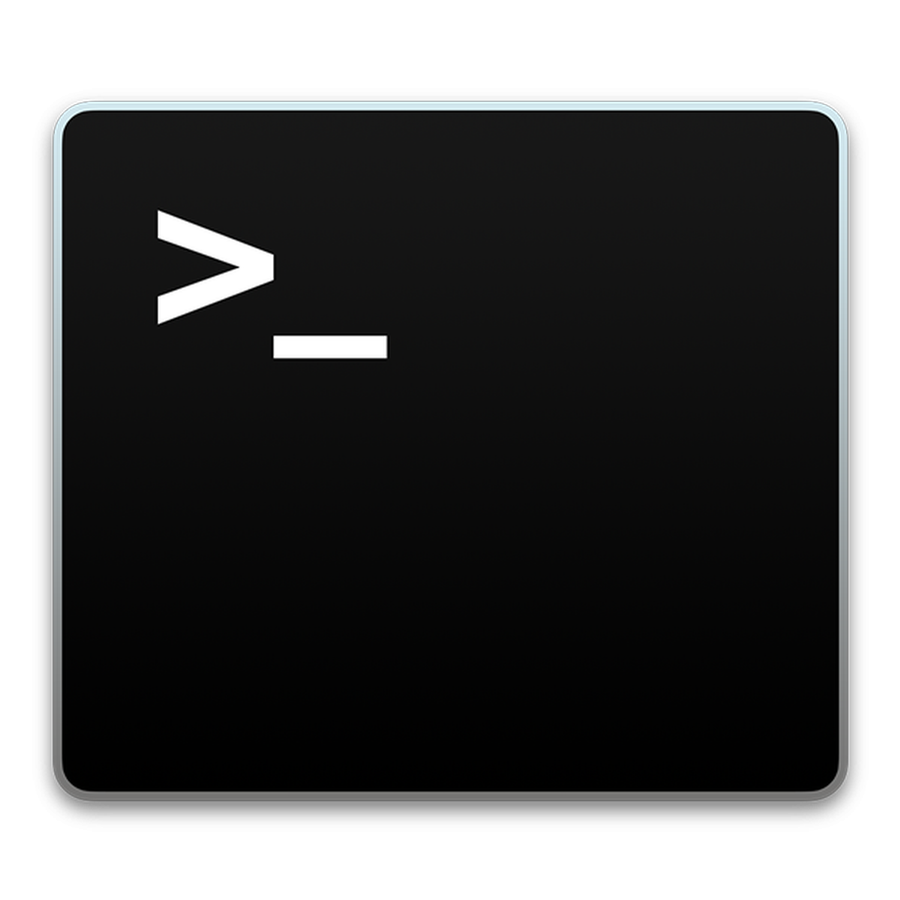

  
  <h3 align="center">Shell</h3>
  
 A Linux based shell.

 

<!-- TABLE OF CONTENTS -->

  
Table of Contents

  <ol>
    <li>
      <a href="#about">About</a>
    </li>
    <li>
      <a href="#getting-started">Getting Started</a>
    </li>
    <li><a href="#usage">Usage</a></li>
    <li><a href="#author">Author</a></li>
  </ol>

<!-- ABOUT -->
## About
*Following features are implemented:*

    1. Read commands in a loop
    2. Show User based prompt
    3. Can run simple commands
    4. Can do cd into directories
    5. Output(>) and input(<) redirection (individually as well as combined)
    6. Can Support multiple pipes. 
    7. Pipes(|) and redirection(< >) combination is also implemented
    8. Handle signals Ctrl-C and Ctrl-Z
    9. Can run process in fg and bg  to run process in fg (type):
      fg <id>
      Please note, this id is basically the id which was returned to shell prompt after CTRL+Z 

    10. To exit the program, type exit

<!-- GETTING STARTED -->
## Getting Started
  * Clone the repo and navigate to the project directory.
  * Do `make`
  
    
### Prerequisites
  * Install the libreadline library by:
  
    **sudo apt-get install libreadline-dev**
  

<!-- USAGE EXAMPLES -->
## Usage
  
  To run the shell:
  
  **Usage**: ./shell

<!-- Author -->
## Author
[Deepika Goyal](https://github.com/deepika9294)

